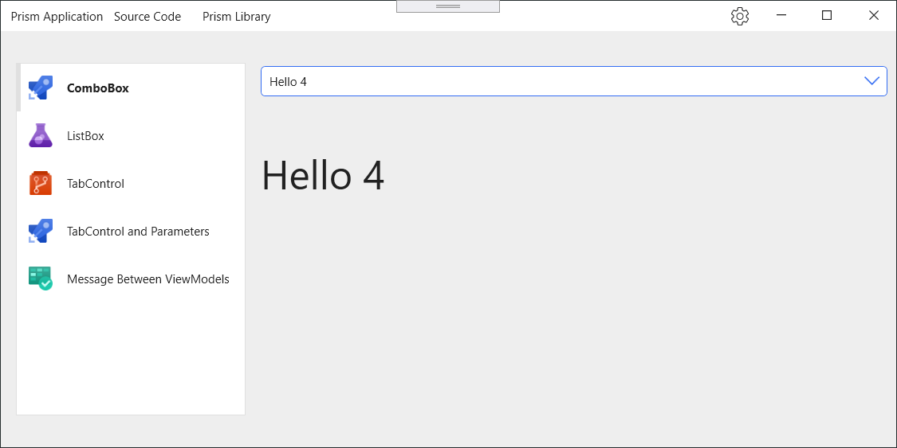
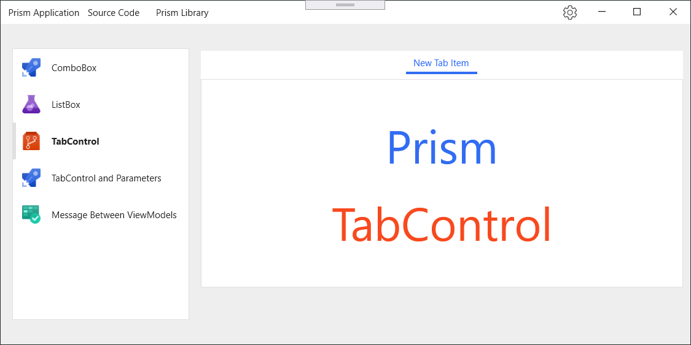
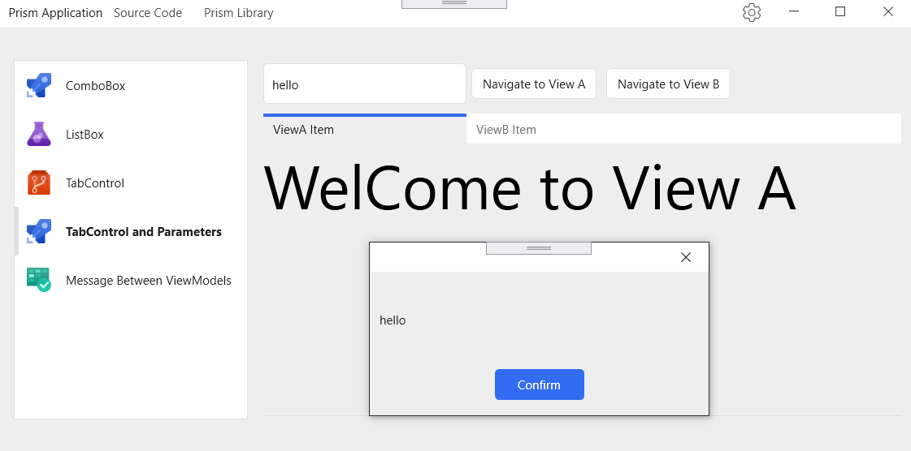
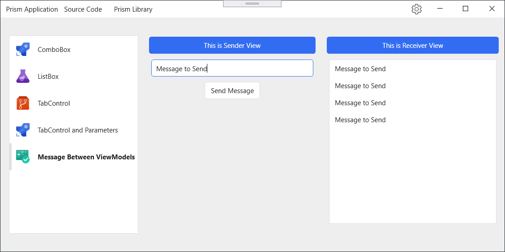

# MVVMPracticePrism
Best Prism MVVM Practice 2020

- MVVM
- Navigation Views
- Sending Parameters between ViewModels
- using TabControl and MVVM
- ComboBox and MVVM
- ListBox and MVVM
- Event To Command
- SelectionChanged
- Commands
- EventAggregator

